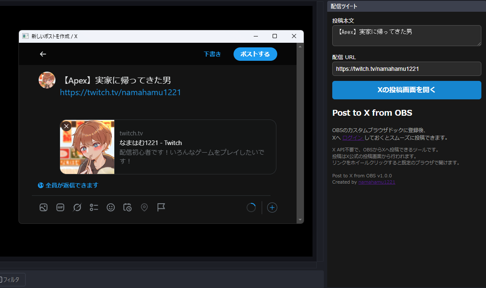

# Post to X from OBS

A simple OBS Browser Dock that opens the official X (Twitter) post screen without requiring the X API or Twitch API.

## Features

* No API required
* HTML only
* OBS Browser Dock compatible
* Automatically saves post content
* Uses the official X post screen

## Usage

1. Add the published URL as a Custom Browser Dock in OBS.
2. Log in to X.
3. Enter your post text and stream URL.
4. Click **Open X Post Screen**.

## Tips

* Left click: Opens the X post screen inside OBS.
* Mouse wheel click: Opens the X post screen in your default browser.

## Privacy

This tool does not send your post content to any external server.

Your post text and stream URL are stored locally in your browser using Local Storage.

---

# 日本語
X APIやTwitch APIを使用せずに、OBSからXへ投稿できるシンプルなツールです。

## 特徴

* API不要
* HTMLのみ
* OBS Browser Dock対応
* 投稿内容を自動保存
* X公式の投稿画面を利用

## 使い方

1. OBSの「カスタムブラウザドック」にURLを追加
2. Xへログイン
3. 投稿本文と配信URLを入力
4. 「Xの投稿画面を開く」をクリック

## ヒント

* 左クリック：OBS内ブラウザで開きます
* ホイールクリック：既定のブラウザで開きます

## プライバシー

このツールは投稿内容を外部サーバーへ送信しません。

投稿内容と配信URLはブラウザのLocal Storageに保存されます。

---

MIT License

Created by @namahamu1221
